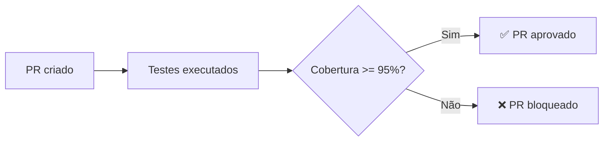
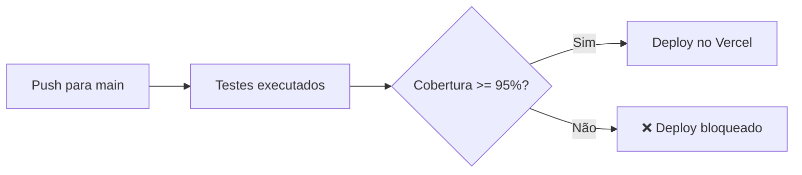

# GitHub Actions - Configuração de Deploy

Este projeto utiliza GitHub Actions para automatizar o processo de CI/CD com deploy automático no Vercel.

## 🔄 Pipeline CI/CD

O pipeline executa automaticamente em:

- **Push** para a branch `main`
- **Pull Requests** para a branch `main`

### Etapas do Pipeline

#### 1️⃣ **Test Job**

- ✅ Checkout do código
- ✅ Configuração do Node.js 22
- ✅ Instalação de dependências
- ✅ Execução do lint
- ✅ Execução dos testes com cobertura
- ✅ Verificação de threshold de cobertura (95% de média)
- ✅ Upload dos relatórios de cobertura para Codecov

#### 2️⃣ **Deploy Job** (apenas em push para main)

- ✅ Deploy automático para Vercel (produção)
- ⚠️ **Só executa se o job de testes passar**

## 📊 Requisitos de Cobertura

O pipeline **bloqueia o deploy** se a média de cobertura for menor que **95%**.

A média é calculada a partir de:

- Statements
- Branches
- Functions
- Lines

**Fórmula:** `Média = (Statements + Branches + Functions + Lines) / 4`

## 🔐 Secrets Necessários

Configure os seguintes secrets no GitHub:

### 1. Vercel Token

```
VERCEL_TOKEN
```

**Como obter:**

1. Acesse https://vercel.com/account/tokens
2. Clique em "Create Token"
3. Dê um nome ao token (ex: "GitHub Actions")
4. Copie o token gerado

### 2. Vercel Organization ID

```
VERCEL_ORG_ID
```

**Como obter:**

1. No terminal, execute: `npx vercel link`
2. Após linkar o projeto, abra: `.vercel/project.json`
3. Copie o valor de `"orgId"`

### 3. Vercel Project ID

```
VERCEL_PROJECT_ID
```

**Como obter:**

1. No terminal, execute: `npx vercel link`
2. Após linkar o projeto, abra: `.vercel/project.json`
3. Copie o valor de `"projectId"`

### 4. Codecov Token (Opcional)

```
CODECOV_TOKEN
```

**Como obter:**

1. Acesse https://codecov.io/
2. Conecte seu repositório GitHub
3. Copie o token fornecido

## ⚙️ Configurando os Secrets no GitHub

1. Acesse seu repositório no GitHub
2. Vá em **Settings** → **Secrets and variables** → **Actions**
3. Clique em **New repository secret**
4. Adicione cada secret com seu respectivo valor

## 🚀 Como Funciona

### Pull Request



### Push para Main



## 📝 Exemplo de Saída

### ✅ Cobertura Aprovada

```
📊 Coverage Results:
  Statements: 100%
  Branches:   87.5%
  Functions:  100%
  Lines:      100%

📈 Average Coverage: 96.88%
🎯 Required: 95%

✅ Coverage check PASSED!
   Average coverage (96.88%) meets the required threshold (95%)
```

### ❌ Cobertura Reprovada

```
📊 Coverage Results:
  Statements: 90%
  Branches:   85%
  Functions:  92%
  Lines:      88%

📈 Average Coverage: 88.75%
🎯 Required: 95%

❌ Coverage check FAILED!
   Average coverage (88.75%) is below required threshold (95%)
```

## 🔧 Troubleshooting

### Erro: "Could not find coverage summary"

- Verifique se o script `test:coverage` está funcionando localmente
- Execute `npm run test:coverage` e veja se gera o relatório

### Deploy não executou

- Verifique se está fazendo push para a branch `main`
- Confirme se o job de testes passou
- Verifique se os secrets estão configurados corretamente

### Erro de autenticação no Vercel

- Confirme se o `VERCEL_TOKEN` está válido
- Verifique se `VERCEL_ORG_ID` e `VERCEL_PROJECT_ID` estão corretos
- Execute `npx vercel link` localmente para obter os IDs corretos

## 📚 Recursos Adicionais

- [GitHub Actions Documentation](https://docs.github.com/en/actions)
- [Vercel CLI Documentation](https://vercel.com/docs/cli)
- [Codecov Documentation](https://docs.codecov.com/)
